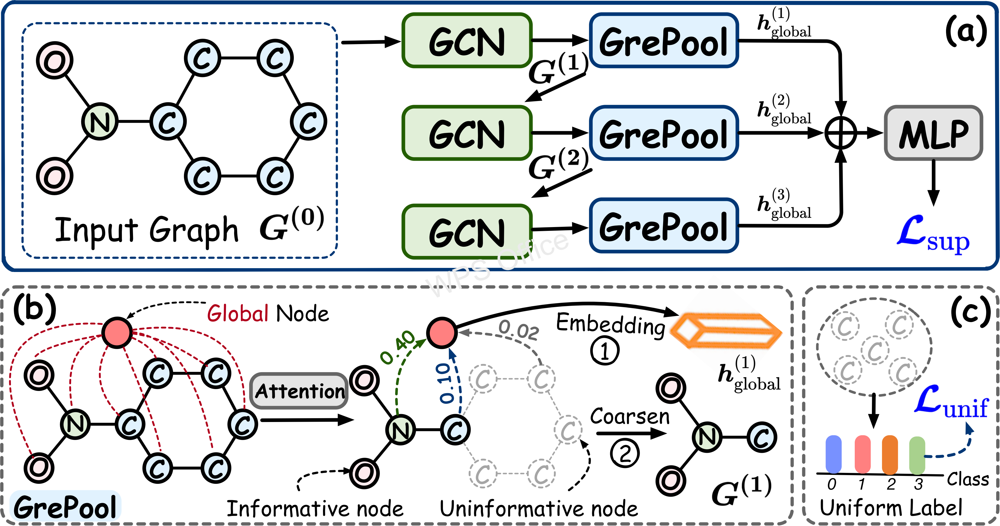

# Graph Explicit Pooling for Graph-Level Representation Learning
Implementation for paper: Graph Explicit Pooling for Graph-Level Representation Learning

## Overview

Graph pooling has been increasingly recognized as crucial for Graph Neural Networks (GNNs) to facilitate hierarchical 
graph representation learning. Existing graph pooling methods commonly consist of two stages: 
selecting top-ranked nodes and discarding the remaining to construct coarsened graph representations. 
However, this paper highlights two key issues with these methods: 

**1)** The process of selecting nodes to discard frequently employs additional Graph Convolutional Networks or 
Multilayer Perceptrons, lacking a thorough evaluation of each node's impact on the final graph representation and 
subsequent prediction tasks. 

**2)** Current graph pooling methods tend to directly discard the noise segment (dropped) of the graph without accounting 
for the latent information contained within these elements. 

To address the **first** issue, we introduce a novel <u>Gr</u>aph <u>e</u>xplicit <u>Pool</u>ng (GrePool) method, 
which selects nodes by explicitly leveraging the relationships between the nodes and final representation vectors crucial 
for classification. The **second** issue is addressed using an extended version of GrePool (*i.e.*, GrePool+), 
which applies a uniform loss on the discarded nodes. This addition is designed  to augment the training process and improve 
classification accuracy. 

### Python environment setup with Conda
```shell
conda create -n grepool python=3.10
conda install pytorch==2.1.0 torchvision==0.16.0 torchaudio==2.1.0 pytorch-cuda=11.8 -c pytorch -c nvidia
conda install pyg -c pyg
pip install rdkit-pypi cython
pip install ogb
pip install pyarrow
pip install transformers
pip install configargparse
pip install loguru
pip install wandb
pip install nvidia-ml-py3
pip install tensorboardX
pip install sortedcontainers
pip install pyyaml
pip install pyg_lib torch_scatter torch_sparse torch_cluster torch_spline_conv -f https://data.pyg.org/whl/torch-2.1.0+cu118.html
```

### Running GrePool (topk version for example)
```shell
conda activate grepool
cd gtpooling_basic_final/
# Running grepool topk version using DD dataset
sh run_tu_dd.sh 0
# Running grepool topk version using ogb datasets
sh run_ogb.sh 0
sh run_pcba.sh 0
```
Supported datasets:
- TuDataset: `NCI1`, `MUTAG`, `PTC-MR`, `NCI109`, `ENZYMES`, `Mutagenicity`, `IMDB-M`, `IMDB-B`
- OGB: `ogbg-molhiv`, `ogbg-moltox21`, `ogbg-moltoxcast`, `ogbg-molpcba`

## Datasets
Datasets mentioned above will be downloaded automatically using PyG's API when running the code.
